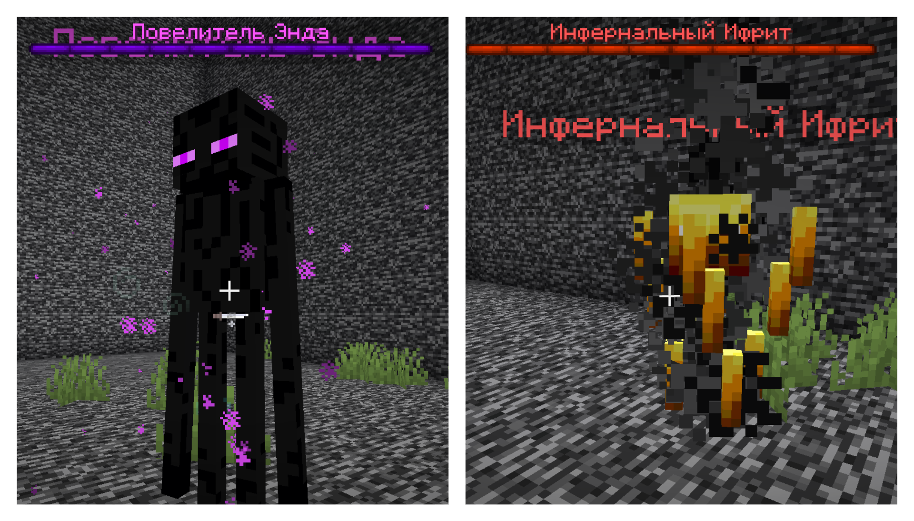
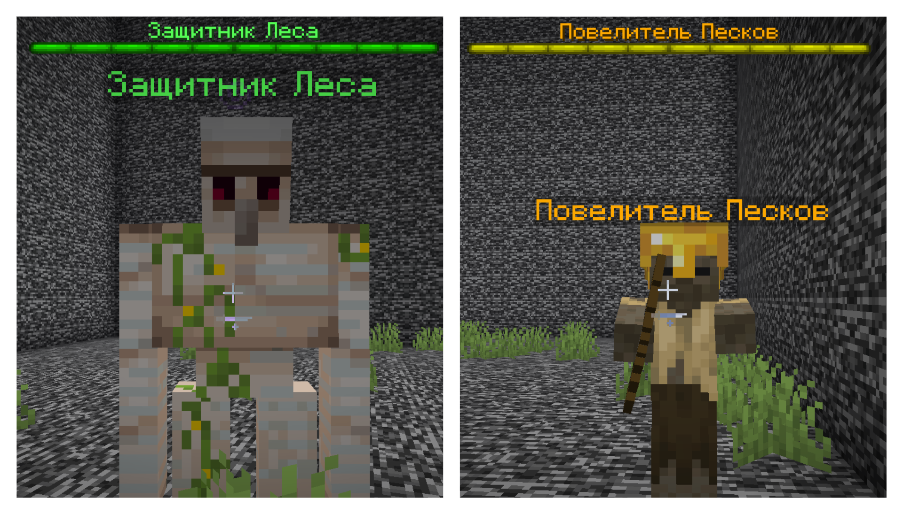

# MiniBosses

MiniBosses — плагин для Minecraft 1.21.8 (Paper), который добавляет уникальных мини-боссов в разные измерения и биомы мира. Каждый босс обладает особыми способностями, призывает помощников при низком здоровье и оставляет ценные награды.

---

## Возможности

- **4 уникальных мини-босса** для разных биомов и измерений
- **Автоматический спавн** с настраиваемыми шансами и кулдаунами
- **Боссбары** с отображением здоровья
- **Специальные способности** для каждого босса
- **Система помощников** - при 60%, 40% и 20% HP боссы призывают союзников
- **Интеграция с WorldGuard** - учитывает флаги спавна мобов и не спавнит босов на территориях с приватом
- **Настраиваемые награды** и команды при смерти
- **Проверка AFK** через Essentials
- **Игнорирование спавна** для игроков с пермишеном

---

## Боссы

### 🏹 Повелитель Энда
- **Спавн**: Энд
- **Способности**: Телепортация, ослепление игроков, телепортация игроков к себе
- **Помощники**: эндермиты
- **Награды**: Жемчуг Края, Глаза Эндера, Хорус-фрукты, Раковины шалкеров

### 🔥 Инфернальный Ифрит
- **Спавн**: Адские крепости (Незер)
- **Способности**: Огненный шторм, файерболы, телепортация
- **Помощники**: магма-кубы
- **Награды**: Стержни ифрита, незерские кирпичи, золотые самородки



### 🌳 Защитник Леса
- **Спавн**: Лесные биомы
- **Способности**: Землетрясение, замедление, отбрасывание, притягивание
- **Помощники**: агрессивные волки
- **Награды**: Железо, яблоки, бревна

### 🏜️ Повелитель Песков
- **Спавн**: Пустынные биомы
- **Способности**: Песчаная буря, голод, стрелы с замедлением
- **Помощники**: Пустынне зомби с ломатами
- **Награды**: Золото, кактусы, песчаник, шкуры кроликов



---

## Конфигурация

```yaml
# Автоматический спавн
auto-spawn:
  enabled: true
  check-interval: 300  # Интервал проверки в секундах
  no-boss-spawn-radius: 100  # Радиус без других боссов

# Босс Энда
ender-boss:
  enabled: true
  spawn-chance: 15.0  # Шанс спавна в процентах
  cooldown: 3600      # Кулдаун в секундах
  health: 300.0       # Здоровье
  ability-chance: 0.3 # Шанс использования способности

# Босс Ада
nether-boss:
  enabled: true
  spawn-chance: 15.0
  cooldown: 3600
  health: 320.0
  ability-chance: 0.3

# Босс Леса
forest-boss:
  enabled: true
  spawn-chance: 15.0
  cooldown: 3600
  health: 400.0
  ability-chance: 0.3

# Босс Пустыни
desert-boss:
  enabled: true
  spawn-chance: 15.0
  cooldown: 3600
  health: 320.0
  ability-chance: 0.3
```

**Полный конфиг:** [config.yml](src/main/resources/config.yml)

---

## Команды и права

**Команды:**
- `/minibosses reload` - перезагрузить конфигурацию
- `/minibosses spawn <тип>` - призвать босса (ender/nether/forest/desert)

**Права:**
- `minibosses.admin` - доступ к админ-командам
- `minibosses.ignore` - игнорировать спавн боссов рядом с игроком

---

## Установка

1. Скачайте **последний релиз** из раздела [Releases](../../releases)
2. Поместите файл `.jar` в папку `/plugins/`
3. Перезапустите сервер
4. Настройте конфигурацию в `/plugins/MiniBosses/config.yml`
5. Используйте `/minibosses reload` для применения изменений

---

## Требования

- **Minecraft**: 1.21.8 (Paper)
- **Java**: 21
- **Опционально**: EssentialsX (для проверки AFK), WorldGuard (для проверки территории)

---
